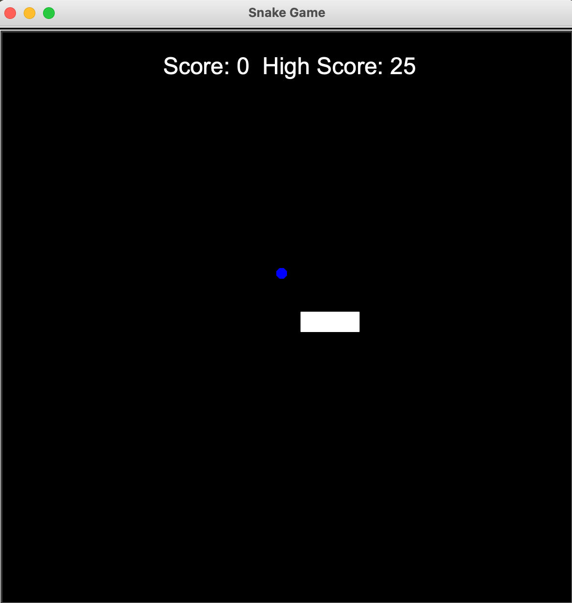

# Snake Game 🐍

A Python GUI application designed to recreate the world-famous snake game using the turtle graphics module.

## Getting Started

### Dependencies

* Make sure you have the latest version of [Python](https://www.python.org/downloads/) installed on your computer (verify that the correct OS has been selected). 

### Installing and Running the program

* Download and extract the ZIP file from the [repository](https://github.com/aaronowusu/snake_game.git).
* Run the main.py file as you would any other Python script (.py) file.
* Ensure that you keep all the other (.py) files in the same location as main.py.

### Instructions 🎮

* Users are required to use WASD to move the snake.
* When the snake eats a food item, the score is increased by one and a segment is added to the snake body.
* The game restarts when the snake collides with the walls or itself.

## Authors

Aaron Owusu

If you're having any kind of trouble, please feel free to contact me via [email](mailto:aaronoseiowusu@outlook.com).

## Acknowledgments
* [Dr. Angela Yu](https://twitter.com/yu_angela?lang=en)

## Screenshot

